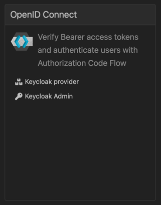
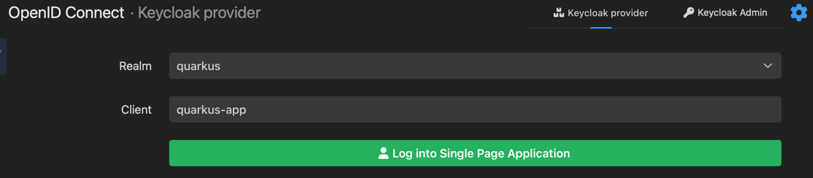
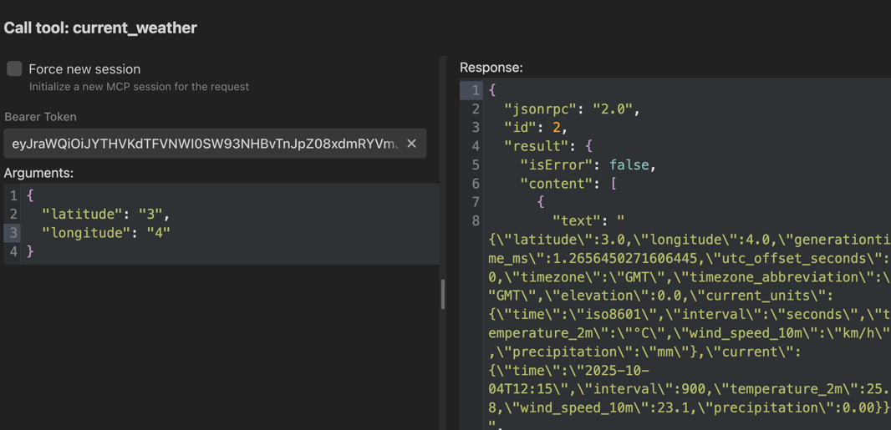

# Step 5 - MCP Server

> [!NOTE]
> You build this in your `step-00-your-solution` workspace, not in this folder. The steps are cumulative, so apply the changes below on top of what you built in the previous step. This `step-05-mcp-server` folder is the finished reference for this step, so compare against it if you get stuck.
>
> To see only what this step adds, run this from the repository root: `diff -ru step-04-tools/src step-05-mcp-server/src`

Now that we know how we can use external tools we can now move on to MCP servers.
MCP servers are a way to create a tool that any language model can use.
For enterprise usage we can imagine setting up a dedicated MCP server for an external tool.

For the above use case we would also need authentication and authorization. This was initially not specified by the
specification but in Quarkus it's straightforward to implement.

For more information on MCP see the [documentation](https://modelcontextprotocol.io/docs/getting-started/intro) and
the [Quarkus MCP Server extension](https://docs.quarkiverse.io/quarkus-mcp-server/dev/index.html).

## Weather tool

Now that we know our location we can use it to get the weather forecast.
Instead of creating a tool directly we are going to create an MCP server.

> [!NOTE]
> A complete reference for this MCP server lives in the `weather-mcp-server` module at the root of this repository.
> The steps below build the simple version that calls the public Open-Meteo API directly.
> The reference module goes a bit further and also demonstrates the optional token propagation pattern described at
> the end of this step (a secured internal `/weather` resource called through a second REST client with `@AccessToken`).
> You can ignore that extra part if you just want the basics working.

### Quarkus project

1. Start by creating a new Quarkus project.
   Navigate to https://code.quarkus.io/ and create a new project.
2. Enable the following extensions (while creating the project):

    - `quarkus-rest-client`
    - `quarkus-rest-client-oidc-token-propagation`
    - `quarkus-oidc`
    - `quarkus-mcp-server-http`

3. Download the project, unzip it and open it in your favorite IDE.

4. You should set the http port to a dedicated port to avoid conflicts with the other app:

```properties
quarkus.http.port=8081
```

5. Now you can start the MCP server:

```shell
./mvnw quarkus:dev
```

### Weather client

Create another REST client to get the weather forecast.

```java
@Path("/v1")
@RegisterRestClient(baseUri = "https://api.open-meteo.com")
public interface WeatherClient {

    @GET
    @Path("/forecast")
    String forecast(@RestQuery String latitude,
                    @RestQuery String longitude,
                    @RestQuery String current
    );
}
```

### Weather MCP Server

Now we can create the MCP server for the weather forecast.

```java
public class WeatherMcpServer {

    @RestClient
    WeatherClient weatherClient;

    @Tool(name = "current_weather", description = "Get current weather forecast for a location.")
    ToolResponse forecast(String latitude, String longitude) {
        String forecast = weatherClient.forecast(latitude, longitude, "temperature_2m,wind_speed_10m,precipitation");
        return ToolResponse.success(new TextContent(forecast));
    }
}
```

Here we inject the weather client and use it to get the weather forecast.
Next we register the tool for the MCP server with the `@Tool` annotation.
Give it a good name and description so other language models can use it.

### Logging

Again we enable logging to audit what is happening:

```properties
# Enable MCP logging
quarkus.mcp.server.traffic-logging.enabled=true
quarkus.mcp.server.traffic-logging.text-limit=1000
# Log REST client request-response
quarkus.rest-client.logging.scope=request-response
```

### Authentication

We have now created an MCP server that can be used by other language models.
But we need to make sure that only authorized users can use it.

```properties
quarkus.http.auth.permission.authenticated.paths=/mcp/sse
quarkus.http.auth.permission.authenticated.policy=authenticated
```

Furthermore, you can use the `@RolesAllowed` annotation on the tool to restrict access to specific roles if needed.

After enabling authentication we now need a bearer token to access the MCP server.
You can obtain one for testing through the Quarkus Dev UI



http://localhost:8081/q/dev-ui/quarkus-oidc/keycloak-provider



Sign in with either `alice:alice` or `bob:bob` and copy the access token.

You can use the access token to test the MCP server endpoint - your Weather tool!

1. Go to Quarkus Dev UI > _Extensions_ > _Tools_ > _Call_
2. Call the endpoint by passing the access token and some input (latitude and longitude):

See https://docs.quarkiverse.io/quarkus-mcp-server/dev/index.html#_development_mode



### Token propagation

If the weather REST API is protected by Keycloak you can use the `quarkus-rest-client-oidc-token-propagation` extension
to propagate the token to the weather client.

```xml

<dependency>
    <groupId>io.quarkus</groupId>
    <artifactId>quarkus-rest-client-oidc-token-propagation</artifactId>
</dependency>
```

And annotate the weather client with the `@AccessToken`, see https://quarkus.io/guides/security-openid-connect-client
For the simple version we build here this is not needed, since Open-Meteo is a public API.
The `weather-mcp-server` reference module shows this pattern in action: it exposes a secured internal `/weather` resource
and calls it through a `WeatherClientInternal` annotated with `@AccessToken`, which propagates the user's token.

### MCP Client

Now that we have the MCP server with authentication we can use it from our AI agent.
Go back to the original AI agent project and add the following extension:

```xml

<dependency>
    <groupId>io.quarkiverse.langchain4j</groupId>
    <artifactId>quarkus-langchain4j-mcp</artifactId>
</dependency>
```

To use it you only need to add the following configuration:

```properties
quarkus.langchain4j.mcp.weather.transport-type=http
quarkus.langchain4j.mcp.weather.url=http://localhost:8081/mcp/sse
```

And tell the AI agent to use the `weather` tool:

```java
import io.quarkiverse.langchain4j.mcp.runtime.McpToolBox;

@McpToolBox("weather")
```

### MCP Client with authentication

Next we also need another extension to automatically propagate the access token to the MCP server:

```xml

<dependency>
    <groupId>io.quarkiverse.langchain4j</groupId>
    <artifactId>quarkus-langchain4j-oidc-mcp-auth-provider</artifactId>
</dependency>
```

This extension provides an instance of the `McpClientAuthProvider`,
see https://docs.quarkiverse.io/quarkus-langchain4j/dev/mcp.html#_authorization

### How the two apps trust each other

For the propagated token to be accepted, the agent (8080) and the `weather-mcp-server` (8081) must trust the same token issuer. In dev mode this happens automatically: neither app sets `quarkus.oidc.auth-server-url`, so each one wants a Keycloak Dev Service. Quarkus does not start a second Keycloak if it finds an existing container labeled `quarkus-dev-service-keycloak` with a matching service name (default `quarkus`), so whichever app starts second reuses the first app's Keycloak. One Keycloak, one issuer, one set of users (`alice`, `bob`), so a token minted for the agent validates at the weather server.

To verify it is shared: with both apps running, the second app's log shows a line like `Dev Services container found: ... (quay.io/keycloak/keycloak) Connecting to: ...`, and `docker ps` (or `podman ps`) shows a single Keycloak container.

> [!IMPORTANT]
> This shared Keycloak only exists in dev mode. In production there are no Dev Services, so you must point both applications at the same real Keycloak by setting the same `quarkus.oidc.auth-server-url`. Also keep the default Dev Service settings: do not disable container sharing and do not give the two apps different `quarkus.keycloak.devservices.service-name` values, or each one starts its own Keycloak and the propagated token is rejected with a 401.

### Run the AI agent

Finally, you can run the AI agent and use the `weather` tool.
Try asking it about the weather in your location.

> [!IMPORTANT]
> Both applications must be running at the same time.
> Start the `weather-mcp-server` on port 8081 and the AI agent on port 8080.
> The agent is an MCP client of the weather server, so the `weather` tool only works when the server is up.

> [!NOTE]
> You might want to tweak the system message for your AI agent.

## Next step

Now you are ready to move to the next [step](./../step-06-rag/README.md).
